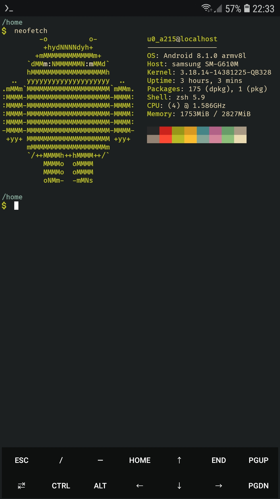

# Termux Setup

Um script para minha configuração do termux.

## ATENÇÃO:

- Leia o script antes de executa-lo.
- Não me responsabilizo por danos.
- Fique a vontade para editar o script para seu uso/gosto.
- Caso queira personalizar o seu termux com temas e fontes, use o [Termux:Styling](https://f-droid.org/en/packages/com.termux.styling/).

## Download/Execução:
- Se o mirror estiver ruim execute esse comando `termux-change-repo`
- Dentro do termux execute esses comandos:

```bash
pkg update && pkg upgrade
pkg install wget -y
wget -c "https://github.com/frannks/termux_setup/raw/main/termux_setup.sh"
chmod +x termux_setup.sh && ./termux_setup.sh
```

## Demonstração:



## Contatos:

[Telegram](https://t.me/FranklinTech)

[Email](mailto:fraank@riseup.net)
